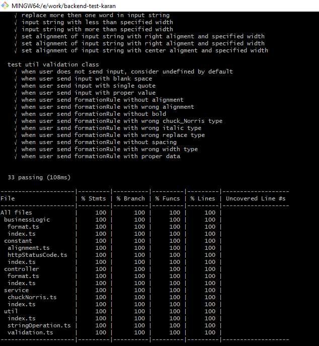
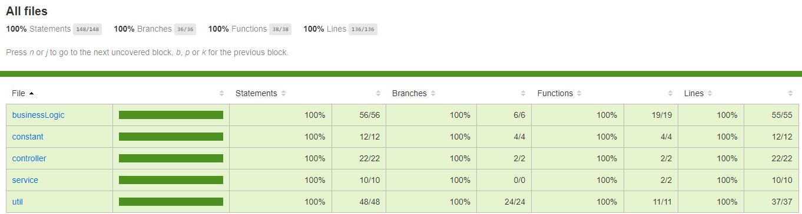

## Quick Start on dev machine
```
> bash deploy.sh dev
```

## Start on docker container (production ready) 
```
> bash deploy.sh start
```

## Local machine url
```
> http://localhost:8000/format
```

## Tech-Stack

| Component        	| Attribute					| version    | Reference |
| ------------- 	|-------------		| -------------	|-------------|
| express | framework | 4.17.1 | https://www.npmjs.com/package/express
| axios | HTTP clinet | 0.21.1 | https://www.npmjs.com/package/axios
| cors | cros | 2.8.5 | https://www.npmjs.com/package/cors
| wide-align | string alignment | 1.1.3 | https://www.npmjs.com/package/wide-align
| word-wrap | string wrapping | 1.2.3 | https://www.npmjs.com/package/word-wrap
| chai | assertion library | 4.3.4 | https://www.npmjs.com/package/chai
| mocha | testing framework | 8.4.0 | https://www.npmjs.com/package/mocha
| typescript | language | 4.2.4 | https://www.npmjs.com/package/typescript
| sinon | spies, stubs and mocks | 10.0.0 | https://www.npmjs.com/package/sinon
| nyc | code coverage tool | 15.1.0 | https://www.npmjs.com/package/nyc
| nock | HTTP server mocking | 13.1.0 | https://www.npmjs.com/package/nock
| eslint | static code analyzer | 7.25.0 | https://www.npmjs.com/package/eslint
| husky | git hooks | 4.3.8 | https://www.npmjs.com/package/husky
| ts-node | TypeScript execution engine for node | 9.1.1 | https://www.npmjs.com/package/ts-node
| nodemon | utility monitor for development | 2.0.7 | https://www.npmjs.com/package/nodemon
| docker | container engine | 20.10.5 | https://docs.docker.com/docker-for-mac/install/


## Understanding of request parameters
-   There are there parameters **input**, **formatRule** & **formatRuleType**.
-   **input** : it's an input string which is mandatory.
-   **formatRule** : it's an custom speified foramt rule & it is optional, below is custom foramt rule structure.
-   All fields are mandatory
    ```
    {
        width : type of number
        alignment : type of string
        spacing : type of string
        bold : type of array
        italic : type of array
        replace : type of array
        chuck_Norris : type of array
    }
    ```
-   **formatRuleType** : it's an pre-defined speified foramt type id & it is optional.
-   When request does not contain **formatRule** & **formatRuleType** then default format rule type applied.
-   When request contain both **formatRuleType** &&  **formatRule** then **formatRuleType** gets high priority.
-   Currently, there three format rule type define : default, suppiler-1, restaurants-1


##  Sample request
```
{
    "input" : " If you are looking to have an impact on the world, then read carefully because",
    "formatRule" : {
        width:80;
        alignment:"center;
        spacing:"\n";
        bold:["choco"];
        italic:["Choco"];
        replace:["Choco,CHOCO"];
        chuck_Norris:["industry"];
        },
    "formatType" : "default"
}
```

## Unit test & code covrage rerport
```
> bash deploy.sh test
```

### covrage rerport path
```
> {project folder}/coverage/index.html
```





_________________________________________________________________________________________________


# backend-exercise-template

Template exercise to be copied and distributed to candidates. Any update and change should be committed here.

# Choco Backend Interview Exercise

## Process

1. This repo is your own, you can use it to work and commit your solution here. 
2. Solve the exercise within a timeframe of 1 week. It normally takes around 3-4 hours to complete.
3. Once you are ready with your solution submit a Pull Request and we will review your task and leave comments.
4. We review your solution within 2 days, provide feedback for you and schedule a call to discuss as a next step.
5. Demo your solution to future colleagues (product managers and engineers) on the call.

## Skills we're looking for

- Structured problem solving.
- Communication: explain your rationale, trade-offs and limitations of the system.
- Systematic approach to navigate the ambiguity of the problem.
- Code organization and quality.

## How we will evaluate your solution

1. Correctness: 50%
2. Clean code: 35%
3. Performance: 15%

## The epic

Design a service that given a string with line breaks ("\n") and formatting parameters, returns a string formatted with basic markdown syntax.

Example input:

```
If you are looking to have an impact on the world, then read carefully because at Choco, we are moving mountains to transition the world into sustainable food systems.\nThe food industry is an industry with essential problems, especially in food-supply-chain. We are now leveraging technology to bring change and start the necessary transformation the industry is craving for.\nWe are building the digital platform on which the global food trade will operate. Our company has the potential to reduce food prices, decrease food waste by 30% and reshape one of the oldest and largest industries on the planet.
```

The service should be able to:

- Limit text to a specified line width.
- Align text to left, right and center within the specified line width.
- Set single or double line spacing.
- Given a list of words, turn them bold using markdown syntax. (ie. all **Choco** words in text should be made bold)
- Given a list of words, turn them italic using markdown syntax. (ie. all _food_ words in text should be made italic)
- Given a list of words and their substitutions, replace all occurrences of the specified words with their substitutions. (ie. replace every Choco with CHOCO and so on)
- Given a list of words, add a random Chuck Norris food fact after the paragraph where such words are found. (possible source https://api.chucknorris.io/)

Further requirements would be added in the next sprint.

### A test case

Given the parameters:

```
- Line width: 80
- Text alignment: right
- Spacing: single
- Bold strings: "Choco", "Chuck", "Norris"
- Italic strings: "food"
- Replace strings: ("Choco", "CHOCO"), ("sustainable", "SUSTAINABLE")
- Chuck Norris food fact strings: "industry", "change"
```

And the input text:

```
If you are looking to have an impact on the world, then read carefully because at Choco, we are moving mountains to transition the world into sustainable food systems.\nThe food industry is an industry with essential problems, especially in food-supply-chain. We are now leveraging technology to bring change and start the necessary transformation the industry is craving for.\nWe are building the digital platform on which the global food trade will operate. Our company has the potential to reduce food prices, decrease food waste by 30% and reshape one of the oldest and largest industries on the planet.
```

One possible output could be:

```
 If you are looking to have an impact on the world, then read carefully because\n at **Choco**, we are moving mountains to transition the world into SUSTAINABLE\n                                                                _food_ systems.\n      The _food_ industry is an industry with essential problems, especially in\n  food-supply-chain. We are now leveraging technology to bring change and start\n                      the necessary transformation the industry is craving for.\n When **Chuck** **Norris** is in the mood for seafood... he enjoys fresh caught\n                                                                    Kracken!!!!\n     We are building the digital platform on which the global _food_ trade will\noperate. Our company has the potential to reduce _food_ prices, decrease _food_\nwaste by 30% and reshape one of the oldest and largest industries on the planet.
```

Or what's the same but replacing the "\n" with actual line breaks for better readability in this Readme:

```
 If you are looking to have an impact on the world, then read carefully because
 at **Choco**, we are moving mountains to transition the world into SUSTAINABLE
                                                                _food_ systems.
      The _food_ industry is an industry with essential problems, especially in
  food-supply-chain. We are now leveraging technology to bring change and start
                      the necessary transformation the industry is craving for.
 When **Chuck** **Norris** is in the mood for seafood... he enjoys fresh caught
                                                                    Kracken!!!!
     We are building the digital platform on which the global _food_ trade will
operate. Our company has the potential to reduce _food_ prices, decrease _food_
waste by 30% and reshape one of the oldest and largest industries on the planet.
```


